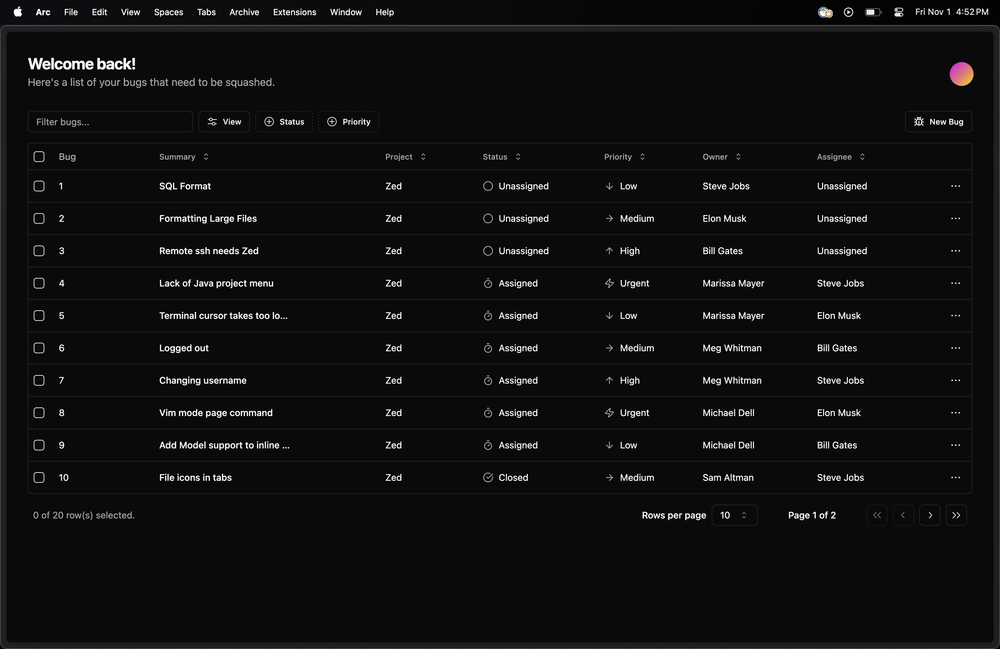
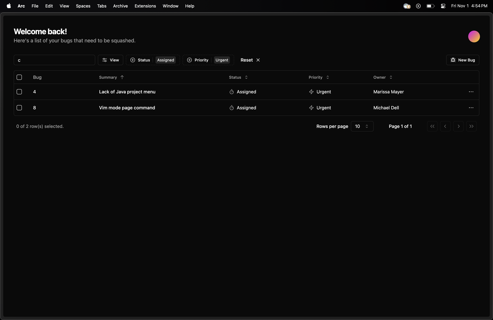
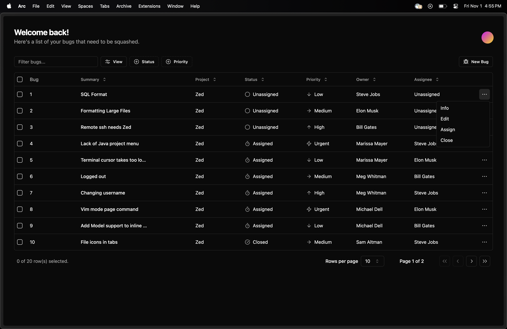
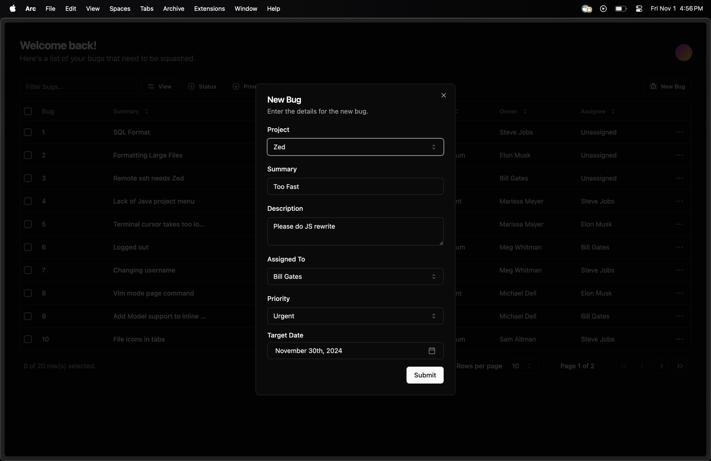
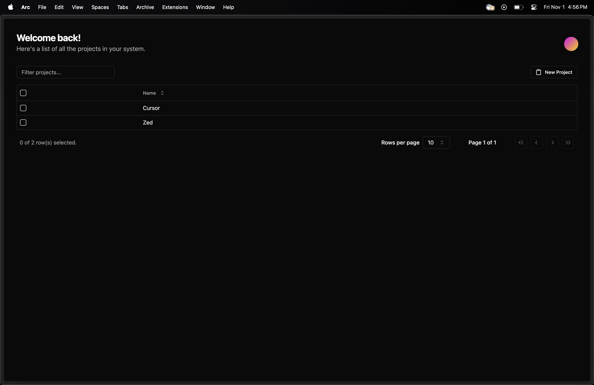
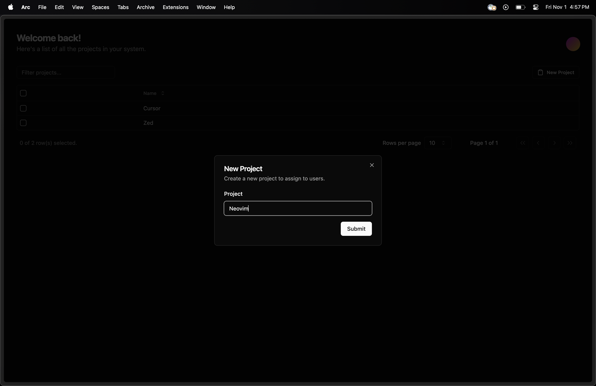
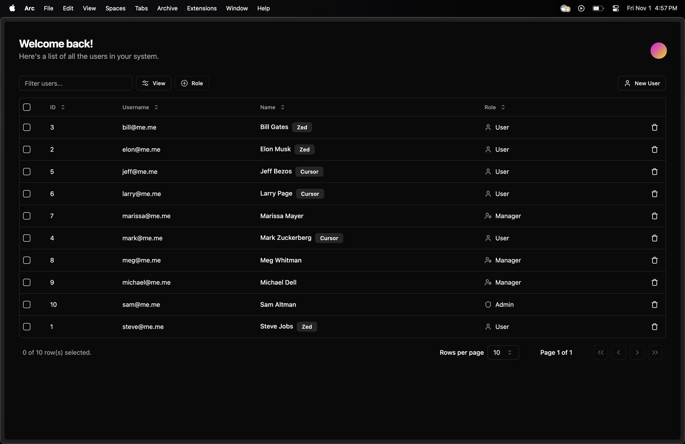
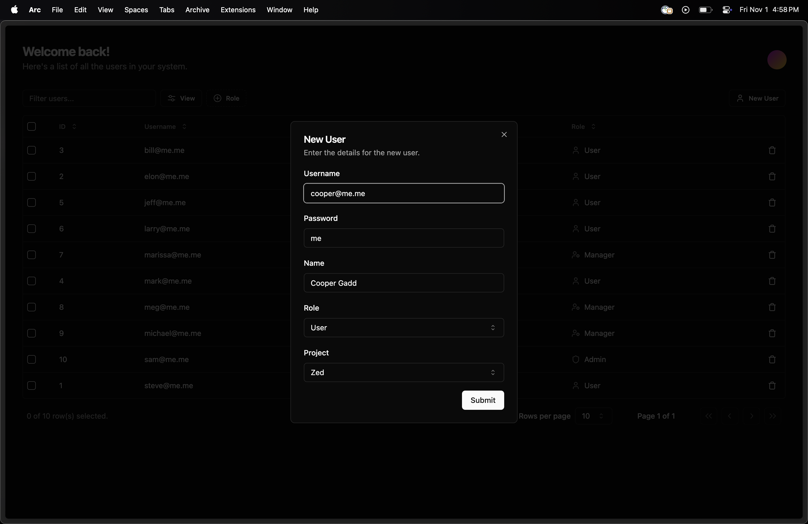
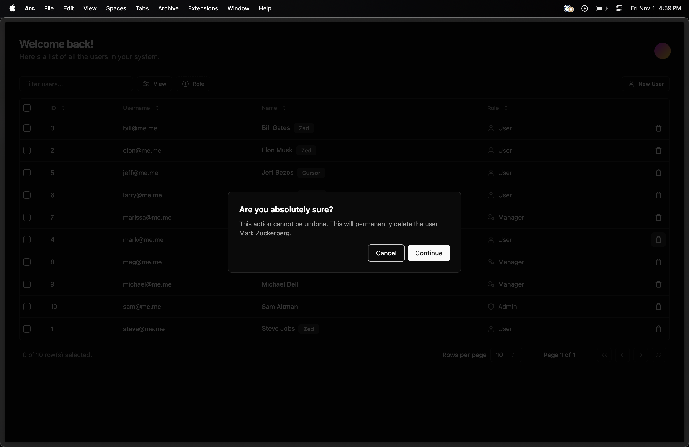
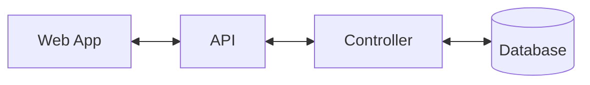

# Bug Tracking System

## Project Overview
This bug tracking system is developed for my Server Programming class, featuring a React frontend and PHP backend. It efficiently manages bugs across various projects with role-based access control.

## Demo

### Bugs Dashboard

### Filtering

### Actions

### New Bug

### Projects Dashboard

### New Project

### Users Dashboard

### New User

### Delete User

## Key Features
- Single Page Application (SPA) with React
- RESTful API backend in PHP
- User Authentication with sessions
- Role-Based Access Control: Admin, Manager, and User roles
- Bug Management: Create, update, and read operations for bugs
- Project Management: Create and manage projects (Admin and Manager)
- User Management: Add, update, and delete users (Admin only)
- Data Visualization: Dynamic views of bugs by project, status, and due date
- Security: Input validation, data sanitization, and password hashing

## Test Users
- **Admin**: Username: `sam@me.me`, Password: `me`
- **Manager**: Username: `meg@me.me`, Password: `me`
- **User**: Username: `steve@me.me`, Password: `me`

## System Architecture Diagram

## Technical Stack
- Frontend: React
- Backend: PHP
- Database: MySQL
- API: RESTful
- Authentication: Sessions

## Libraries and Tools
- **Data Fetching**: [SWR](https://swr.vercel.app/)
- **Library**: [React](https://reactjs.org/)
- **Styling**: [Tailwind CSS](https://tailwindcss.com)
- **Components**: [Shadcn](https://ui.shadcn.com/)
- **Package Manager**: [Bun](https://bun.sh/)

## API Endpoints
- `/api/` - Initialize seed data
- `/api/login` - User login
- `/api/logout` - User logout
- `/api/current-user` - Get current logged-in user
- `/api/bugs` - Get all bugs
- `/api/bug` - Create a new bug
- `/api/bug/{id}` - Update a bug by ID
- `/api/projects` - Get all projects
- `/api/project` - Create a new project
- `/api/roles` - Get all roles
- `/api/priorities` - Get all priorities
- `/api/assign` - Assign a bug to a user
- `/api/close` - Close a bug with a fix description
- `/api/users` - Get all users
- `/api/users/project/{projectId}` - Get users by project ID
- `/api/user/{id}` - Get a user by ID
- `/api/user` - Create a new user
- `/api/user/{id}` - Update a user by ID
- `/api/user/delete/{id}` - Delete a user by ID (GET method due to server limitations)

## User Roles and Permissions
- **Admin**: Full system access
- **Manager**: Project and bug management across all projects
- **User**: Bug entry and management within assigned project

## Security Measures
- Session-based authentication
- Password hashing using bcrypt
- Parameterized queries to prevent SQL injection
- Input validation on both frontend and backend

## Code Structure

### Frontend
- Components: Reusable React components
- Hooks: API communication services

### Backend
- Index: Entry point for API requests
- Controllers: Handle API requests

## Development
- Frontend: Run `bun run dev` in the frontend directory
- Backend: Ensure your PHP server is running and pointing to the backend directory

## Deployment
- Frontend: Build using `bun run build`, deploy the `build` folder
- Backend: Deploy PHP files to a production PHP server
