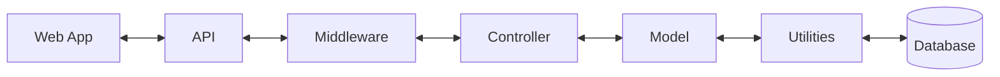

# Bug Tracking System

## Project Overview
This bug tracking system is developed for my Server Programming class, featuring a React frontend and PHP backend. It efficiently manages bugs across various projects with role-based access control.

## Key Features
- Single Page Application (SPA) with React
- RESTful API backend in PHP
- User Authentication with Cookies
- Role-Based Access Control: Admin, Manager, and User roles
- Bug Management: CRUD operations for bugs
- Project Management: Create and manage projects (Admin and Manager)
- User Management: Add, update, and delete users (Admin only)
- Data Visualization: Dynamic views of bugs by project, status, and due date
- Security: Input validation, data sanitization, and password hashing

## System Architecture Diagram

## Technical Stack
- Frontend: React, React Router, Axios
- Backend: PHP
- Database: MySQL
- API: RESTful
- Authentication: Cookies

## API Endpoints
- `/api/auth` - Authentication endpoints
- `/api/bugs` - Bug management endpoints
- `/api/projects` - Project management endpoints
- `/api/users` - User management endpoints

## User Roles and Permissions
- **Admin**: Full system access
- **Manager**: Project and bug management across all projects
- **User**: Bug entry and management within assigned project

## Security Measures
- Cookies for secure authentication
- Password hashing using bcrypt
- CORS configuration for API security
- Parameterized queries to prevent SQL injection
- Input validation on both frontend and backend

## Code Structure
### Frontend
- Components: Reusable React components
- Hooks: API communication services

### Backend
- Controllers: Handle API requests
- Models: Database interactions
- Middleware: Authentication and validation
- Utilities: Helper functions

## Development
- Frontend: Run `bun run dev` in the frontend directory
- Backend: Ensure your PHP server is running and pointing to the backend directory

## Deployment
- Frontend: Build using `bun run build`, deploy the `build` folder
- Backend: Deploy PHP files to a production PHP server
